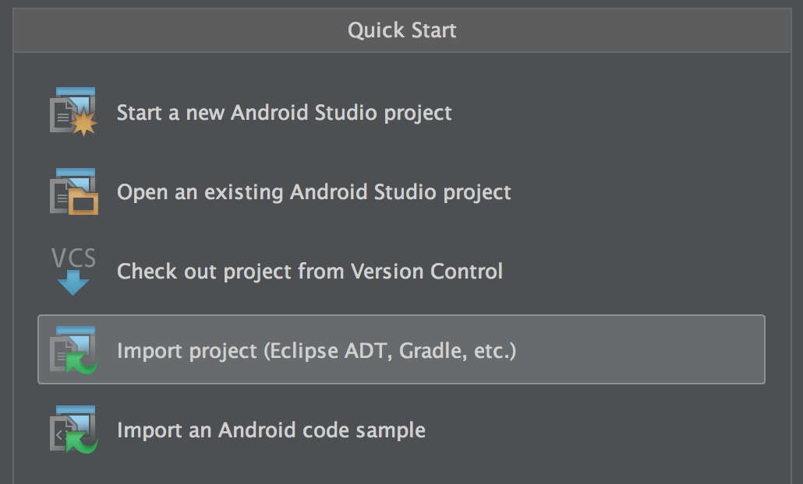
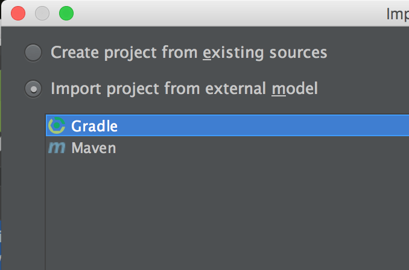
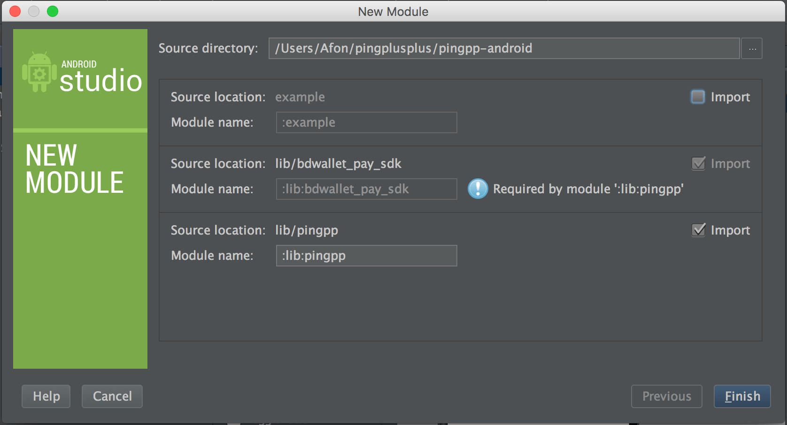
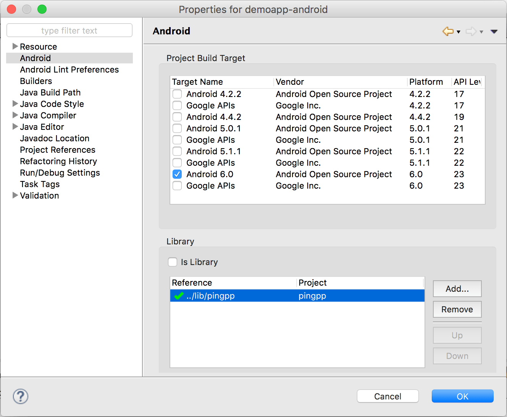

## Ping++ Android SDK 使用文档

### 一、快速体验

Ping++ SDK 为开发者提供了 demo 程序，可以快速体验 Client-SDK 接入流程。下载 Client-SDK 之后将整个目录导入到您的 Android Studio（建议） 或者 Eclipse 之中。

使用 Android Studio 时，请选择 `Import project (Eclipse ADT, Gradle, etc.)` → `Import project from external model` → `Gradle`  




### 二、快速集成

#### 导入 Ping++ SDK

#### 在线导入方式

##### Gradle导入方式
1、在module中的build.gradle中设置
```
dependencies {
	compile 'com.pingxx:pingpp-core:2.1.7' //必须添加
    compile 'com.pingxx:pingpp-alipay:2.1.7' //使用支付宝时添加
    compile 'com.pingxx:pingpp-upacp:2.1.7' //使用银联支付时添加
    compile 'com.pingxx:pingpp-wxpay:2.1.7' //使用微信支付时添加
    compile 'com.pingxx:pingpp-bfb-sdk:2.1.7' // 使用百付宝时添加
    compile 'com.pingxx:pingpp-qpay:2.1.7' //使用QQ钱包时添加
}
```
2、在项目中的build.gradle中添加
```
buildscript {
    repositories {
        jcenter()
    }
}
allprojects {
    repositories {
        jcenter()
    }
}
```

##### Maven导入方式
```
<dependency>
  <groupId>com.pingxx</groupId>
  <artifactId>pingpp-core</artifactId>
  <version>2.1.7</version>
  <type>pom</type>
</dependency>
```

#### 下载SDK导入方式

##### Android Studio
1. 在你的项目里选择 `Import Module...`，Source directory 定位到 `pingpp-android` 目录，也就是 SDK 的根目录。
2. 取消勾选 `:example`，将 `:lib:pingpp` 和 `:lib:bdwallet_pay_sdk` 导入。
3. 将 `:lib:pingpp` 添加到你的项目的 Dependencies。或者直接在 build.gradle 的 dependencies 区块添加如下代码。

        compile project(':lib:pingpp')

    

##### Eclipse ADT
1. 将 `lib` 目录作为 Library Porject 导入。
2. 导入后，把 pingpp 项目作为你的项目的依赖库。

    

##### 权限声明
``` xml
<!-- 通用权限 -->
<uses-permission android:name="android.permission.INTERNET" />
<uses-permission android:name="android.permission.ACCESS_NETWORK_STATE" />
<uses-permission android:name="android.permission.ACCESS_WIFI_STATE" />
<uses-permission android:name="android.permission.READ_PHONE_STATE" />
<uses-permission android:name="android.permission.WRITE_EXTERNAL_STORAGE" />

<!-- 银联需要的权限 -->
<uses-permission android:name="android.permission.NFC" />

<!-- 百度支付需要的权限 -->
<uses-permission android:name="android.permission.ACCESS_COARSE_LOCATION" />
<uses-permission android:name="android.permission.WRITE_SETTINGS" />
<uses-permission android:name="android.permission.READ_SMS" />
```

##### 注册 activity
``` xml
<!-- Ping++ SDK -->
<activity
    android:name="com.pingplusplus.android.PaymentActivity"
    android:configChanges="orientation|screenSize"
    android:launchMode="singleTop"
    android:theme="@android:style/Theme.Translucent.NoTitleBar" >

    <intent-filter>
        <action android:name="android.intent.action.VIEW"/>

        <category android:name="android.intent.category.BROWSABLE"/>
        <category android:name="android.intent.category.DEFAULT"/>

        <data android:scheme="qwalletXXXXXXXX"/>
    </intent-filter>

</activity>

<!-- 微信支付 -->
<activity-alias
    android:name=".wxapi.WXPayEntryActivity"
    android:exported="true"
    android:targetActivity="com.pingplusplus.android.PaymentActivity" />

<!-- 支付宝 -->
<activity
    android:name="com.alipay.sdk.app.H5PayActivity"
    android:configChanges="orientation|keyboardHidden|navigation"
    android:exported="false"
    android:screenOrientation="behind" >
</activity>
<activity
    android:name="com.alipay.sdk.auth.AuthActivity"
    android:configChanges="orientation|keyboardHidden|navigation"
    android:exported="false"
    android:screenOrientation="behind" >
</activity>

<!-- 银联支付 -->
<activity android:name="com.unionpay.uppay.PayActivity" />


<!-- 百度钱包 -->
<activity
    android:name="com.baidu.paysdk.login.LoginActivity"
    android:configChanges="keyboardHidden|navigation|orientation|screenSize"
    android:excludeFromRecents="true"
    android:exported="false"
    android:theme="@style/EbpayThemeActivityWelcome"
    android:windowSoftInputMode="stateHidden" />
<activity
    android:name="com.baidu.paysdk.ui.WelcomeActivity"
    android:configChanges="keyboardHidden|navigation|orientation|screenSize"
    android:excludeFromRecents="true"
    android:exported="@bool/bd_wallet_switch_global_debug"
    android:screenOrientation="portrait"
    android:theme="@style/EbpayThemeActivityWelcome"
    android:windowSoftInputMode="stateHidden" />
<activity
    android:name="com.baidu.paysdk.ui.OrderHomeActivity"
    android:configChanges="keyboardHidden|navigation|orientation|screenSize"
    android:excludeFromRecents="true"
    android:exported="@bool/bd_wallet_switch_global_debug"
    android:hardwareAccelerated="false"
    android:screenOrientation="portrait"
    android:theme="@style/EbpayThemeActivit"
    android:windowSoftInputMode="stateHidden" />
<activity
    android:name="com.baidu.paysdk.ui.PayResultActivity"
    android:configChanges="keyboardHidden|navigation|orientation|screenSize"
    android:excludeFromRecents="true"
    android:exported="@bool/bd_wallet_switch_global_debug"
    android:screenOrientation="portrait"
    android:theme="@style/EbpayThemeActivit"
    android:windowSoftInputMode="stateHidden" />
<activity
    android:name="com.baidu.paysdk.ui.PcPwdCheckActivity"
    android:configChanges="keyboardHidden|navigation|orientation|screenSize"
    android:excludeFromRecents="true"
    android:exported="@bool/bd_wallet_switch_global_debug"
    android:screenOrientation="portrait"
    android:theme="@style/EbpayThemeActivit"
    android:windowSoftInputMode="stateVisible" />
<activity
    android:name="com.baidu.paysdk.ui.PwdCheckActivity"
    android:configChanges="keyboardHidden|navigation|orientation|screenSize"
    android:excludeFromRecents="true"
    android:exported="@bool/bd_wallet_switch_global_debug"
    android:screenOrientation="portrait"
    android:theme="@style/EbpayThemeActivit"
    android:windowSoftInputMode="stateVisible" />
<activity
    android:name="com.baidu.paysdk.ui.PwdSetAndConfirmActivity"
    android:configChanges="keyboardHidden|navigation|orientation|screenSize"
    android:excludeFromRecents="true"
    android:exported="@bool/bd_wallet_switch_global_debug"
    android:theme="@style/EbpayThemeActivit"
    android:windowSoftInputMode="stateVisible" />
<activity
    android:name="com.baidu.paysdk.ui.PwdPayActivity"
    android:configChanges="keyboardHidden|navigation|orientation|screenSize"
    android:excludeFromRecents="true"
    android:exported="@bool/bd_wallet_switch_global_debug"
    android:screenOrientation="portrait"
    android:theme="@style/EbpayThemeActivitTranslucent"
    android:windowSoftInputMode="stateVisible|adjustResize" />
<activity
    android:name="com.baidu.paysdk.ui.PwdPaySmsActivity"
    android:configChanges="keyboardHidden|navigation|orientation|screenSize"
    android:excludeFromRecents="true"
    android:exported="@bool/bd_wallet_switch_global_debug"
    android:screenOrientation="portrait"
    android:theme="@style/EbpayThemeActivitTranslucent"
    android:windowSoftInputMode="stateHidden" />
<activity
    android:name="com.baidu.paysdk.ui.WebViewActivity"
    android:configChanges="keyboardHidden|navigation|orientation|screenSize"
    android:excludeFromRecents="true"
    android:exported="@bool/bd_wallet_switch_global_debug"
    android:screenOrientation="portrait"
    android:theme="@style/EbpayThemeActivit"
    android:windowSoftInputMode="stateHidden" />
<activity
    android:name="com.baidu.paysdk.ui.BindCardNoActivity"
    android:configChanges="keyboardHidden|navigation|orientation|screenSize"
    android:excludeFromRecents="true"
    android:exported="@bool/bd_wallet_switch_global_debug"
    android:launchMode="singleTask"
    android:screenOrientation="portrait"
    android:theme="@style/EbpayThemeActivit"
    android:windowSoftInputMode="stateHidden" />
<activity
    android:name="com.baidu.paysdk.ui.BindCardDetailActivity"
    android:configChanges="keyboardHidden|navigation|orientation|screenSize"
    android:excludeFromRecents="true"
    android:exported="@bool/bd_wallet_switch_global_debug"
    android:launchMode="singleTask"
    android:screenOrientation="portrait"
    android:theme="@style/EbpayThemeActivit"
    android:windowSoftInputMode="stateVisible|adjustPan" />
<activity
    android:name="com.baidu.paysdk.ui.BindCardDetailCredit2Activity"
    android:configChanges="keyboardHidden|navigation|orientation|screenSize"
    android:excludeFromRecents="true"
    android:exported="@bool/bd_wallet_switch_global_debug"
    android:launchMode="singleTask"
    android:screenOrientation="portrait"
    android:theme="@style/EbpayThemeActivit"
    android:windowSoftInputMode="stateVisible|adjustPan" />
<activity
    android:name="com.baidu.paysdk.ui.BindCardDetailCreditActivity"
    android:configChanges="keyboardHidden|navigation|orientation|screenSize"
    android:excludeFromRecents="true"
    android:exported="@bool/bd_wallet_switch_global_debug"
    android:launchMode="singleTask"
    android:screenOrientation="portrait"
    android:theme="@style/EbpayThemeActivit"
    android:windowSoftInputMode="stateVisible|adjustPan" />
<activity
    android:name="com.baidu.paysdk.ui.BindSmsActivity"
    android:configChanges="keyboardHidden|navigation|orientation|screenSize"
    android:excludeFromRecents="true"
    android:exported="@bool/bd_wallet_switch_global_debug"
    android:screenOrientation="portrait"
    android:theme="@style/EbpayThemeActivit"
    android:windowSoftInputMode="adjustResize" />
<activity
    android:name="com.baidu.paysdk.ui.SelectBindCardActivity"
    android:configChanges="keyboardHidden|navigation|orientation|screenSize"
    android:excludeFromRecents="true"
    android:exported="@bool/bd_wallet_switch_global_debug"
    android:screenOrientation="portrait"
    android:theme="@style/EbpayThemeActivit"
    android:windowSoftInputMode="stateHidden" />
<activity
    android:name="com.baidu.paysdk.ui.SignChannelListActivity"
    android:configChanges="keyboardHidden|navigation|orientation|screenSize"
    android:excludeFromRecents="true"
    android:exported="@bool/bd_wallet_switch_global_debug"
    android:hardwareAccelerated="false"
    android:theme="@style/EbpayThemeActivit"
    android:windowSoftInputMode="stateHidden" />
```

### 三、获得 Charge/Order
Charge/Order 对象是一个包含支付信息的 JSON 对象，是 Ping++ SDK 发起支付的必要参数。该参数需要请求用户服务器获得，服务端生成 charge 的方式参考 [Ping++ 开发指南](https://www.pingxx.com/docs/overview)。SDK 中的 demo 里面提供了如何获取 charge 的实例方法，供用户参考。

### 四、发起支付
``` java
//data:表示charge或者order的字符串
Pingpp.createPayment(YourActivity.this, data);
//QQ钱包调起支付方式  “qwalletXXXXXXX”需与AndroidManifest.xml中的data值一致
//建议填写规则:qwallet + APP_ID
Pingpp.createPayment(YourActivity.this, data, "qwalletXXXXXXX");
```

#### 五、获取支付状态
从 Activity 的 onActivityResult 方法中获得支付结果。支付成功后，用户服务器也会收到ping++ 服务器发送的异步通知。 最终支付成功请根据服务端异步通知为准。

``` java
protected void onActivityResult(int requestCode, int resultCode, Intent data) {
    //支付页面返回处理
    if (requestCode == Pingpp.REQUEST_CODE_PAYMENT) {
        if (resultCode == Activity.RESULT_OK) {
            String result = data.getExtras().getString("pay_result");
            /* 处理返回值
             * "success" - 支付成功
             * "fail"    - 支付失败
             * "cancel"  - 取消支付
             * "invalid" - 支付插件未安装（一般是微信客户端未安装的情况）
             */
            String errorMsg = data.getExtras().getString("error_msg"); // 错误信息
            String extraMsg = data.getExtras().getString("extra_msg"); // 错误信息
            showMsg(result, errorMsg, extraMsg);
        }
    }
}
```

### 注意事项
Android 不允许再 UI 线程中进行网络请求，所以请求 charge 对象的时候请使用 thread+handler 或者使用 AsyncTask 。example 里面的示例程序使用的就是 AsyncTask 方式请求 charge 对象。

### 关于定制
用户可以根据需求自行定制一个或者多个支付渠道。但是定制 SDK 的时候需要注意以下几点
- libpingpp-xxxx.jar 和 libpingpp.so 这些包是必须的。
- PaymentActivity 必须在 AndroidManifest.xml 文件里面声明。

        <!-- Ping++ SDK 注册 -->
        <activity
            android:name="com.pingplusplus.android.PaymentActivity"
            android:launchMode="singleTop"
            android:theme="@android:style/Theme.Translucent.NoTitleBar" />
- 权限
    1. 微信支付渠道是通过向“微信”客户端发起请求进行支付的，要求手机必须安装微信。如果没有安装微信，Ping++ SDK 会在支付结果中给予通知。
    2. 支付宝、银联等渠道，需要的权限为

            <uses-permission android:name="android.permission.INTERNET" />
            <uses-permission android:name="android.permission.ACCESS_NETWORK_STATE" />
            <uses-permission android:name="android.permission.ACCESS_WIFI_STATE" />
            <uses-permission android:name="android.permission.READ_PHONE_STATE" />
            <uses-permission android:name="android.permission.WRITE_EXTERNAL_STORAGE" />
    3. 百度支付渠道，需要额外添加权限

            <uses-permission android:name="android.permission.ACCESS_COARSE_LOCATION" />
            <uses-permission android:name="android.permission.WRITE_SETTINGS" />
            <uses-permission android:name="android.permission.READ_SMS" />
- 依赖
    1. 微信支付依赖包：`libammsdk.jar`
    2. 百度支付依赖：`bdwallet_pay_sdk` 工程
    3. 银联支付依赖：`UPPayAssisEx.jar`、`UPPayPluginExPro.jar`、`android-support-v4.jar`、`pingpp/libs` 目录下的 `.so` 文件和 `pingpp/assets` 目录下的 `data.bin` 文件
    4. 支付宝支付依赖包：`alipayxxxxxxxx.jar`
    5. QQ钱包依赖包：`mqqopenpay.jar`
    6. 招行一网通：`cmbkeyboard.jar`[招行具体配置](招行使用说明.md)
- 用户如果选择不使用某种渠道，可以把该渠道相关的 Activity 从 AndroidManifest.xml 删除。

### 混淆设置
用户进行 apk 混淆打包的时候，为了不影响 Ping++ SDK 以及渠道 SDK 的使用，请在 proguard-rules 中添加一下混淆规则。
```
-dontwarn com.alipay.**
-keep class com.alipay.** {*;}

-dontwarn  com.ta.utdid2.**
-keep class com.ta.utdid2.** {*;}

-dontwarn  com.ut.device.**
-keep class com.ut.device.** {*;}

-dontwarn  com.tencent.**
-keep class com.tencent.** {*;}

-dontwarn  com.unionpay.**
-keep class com.unionpay.** {*;}

-dontwarn com.pingplusplus.**
-keep class com.pingplusplus.** {*;}

-dontwarn com.baidu.**
-keep class com.baidu.** {*;}

-keepclassmembers class * {
    @android.webkit.JavascriptInterface <methods>;
}
```

### 日志开关
SDK 提供了日志功能，默认日志为关闭状态。
开发者可以通过下面设置打开日志开关。通过 `PING++` 来对日志进行筛选。
``` java
Pingpp.enableDebugLog(true);
```
