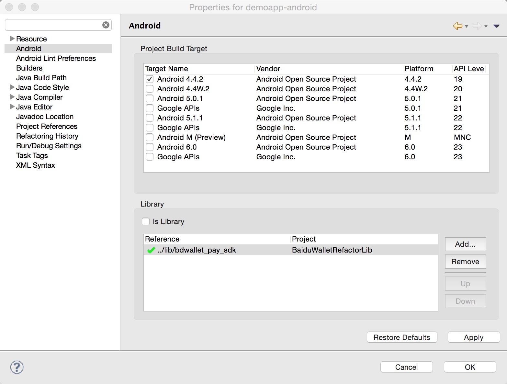
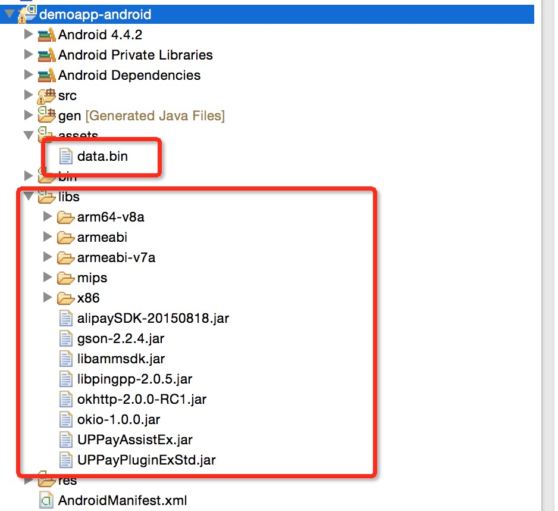
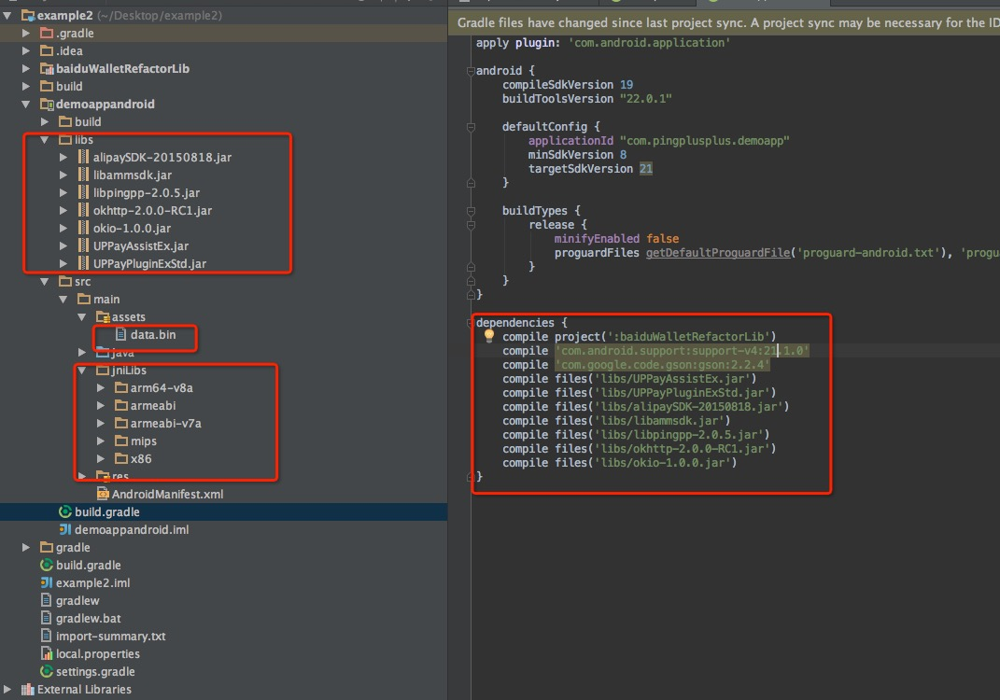
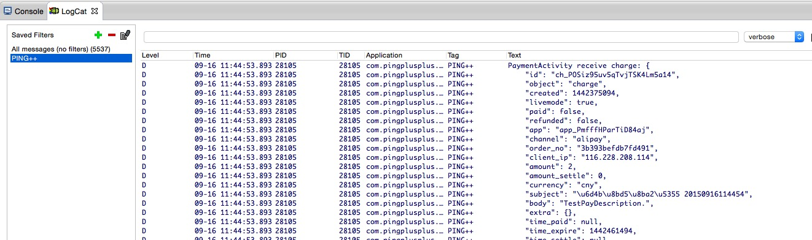

### Ping++ client-sdk 安卓版本使用文档

#### 一、快速体验

    ping++ sdk 为开发者提供了 demo 程序，可以快速体验 client-sdk 接入流程。下载 clent-sdk 之后将 demo 目录导入到您的 eclipse 或者 AndroidStudio 之中。
    
    在 eclipse IDE 中需要您手动导入 lib 目录下面的 bdwallet_pay_sdk 工程到 eclipse 之后，并关联到 demo 项目。关联的步骤为：右击 demo 名称（导入 eclipse 后 demo 的名称为 demoapp-android）-> Properties -> Android ，在下方的 Library 选项中，添加 bdwallet_pay_sdk 项目。
 

#### 二、快速集成

##### 添加依赖包
     1. alipaySDK-xxxxxxxx.jar
     2. libammsdk.jar
     3. libpingpp-x.x.x.jar
     4. UPPayAssistEx.jar
     5. UPPayPluginExStd.jar
     6. arm64-v8a
     7. armeabi
     8. armeabi-v7a
     9. mips
    10. x86
    11. android-support-v4.jar
    
     以上所有文件位置在下载目录的 lib/libs ，请把上面所有文件添加到 Android 工程的 libs目录下面。（如果是 AndroidStudio IDE ，so 文件请添加到 jniLibs 目录之中）。
     将 lib/assets 目录下面的 data.bin 添加到 Android 工程的 assets 目录下面。
     
 
 eclipse IDE    
 
 
 
 
 AndroidStudio IDE
 
 
     
     
##### 权限声明
    <!-- 通用权限 -->
    <uses-permission android:name="android.permission.INTERNET" />
    <uses-permission android:name="android.permission.ACCESS_NETWORK_STATE" />
    <uses-permission android:name="android.permission.ACCESS_WIFI_STATE" />
    <uses-permission android:name="android.permission.READ_PHONE_STATE" />
    <uses-permission android:name="android.permission.WRITE_EXTERNAL_STORAGE" />

    <!-- 百度支付需要的权限 -->
    <uses-permission android:name="android.permission.ACCESS_COARSE_LOCATION" />
    <uses-permission android:name="android.permission.WRITE_SETTINGS" />
    <uses-permission android:name="android.permission.WRITE_EXTERNAL_STORAGE" />
    <uses-permission android:name="android.permission.READ_SMS" />           
    
##### 注册 activity
 
    <!-- Ping++ sdk -->
    <activity
        android:name="com.pingplusplus.android.PaymentActivity"
        android:configChanges="orientation|screenSize"
        android:launchMode="singleTop"
        android:theme="@android:style/Theme.Translucent.NoTitleBar" />
    <!-- 微信支付 sdk ，也是 Ping++ sdk 调用入口 -->
    <activity-alias
        android:name=".wxapi.WXPayEntryActivity"
        android:exported="true"
        android:targetActivity="com.pingplusplus.android.PaymentActivity" />
    <!-- 支付宝 sdk -->
    <activity
        android:name="com.alipay.sdk.app.H5PayActivity"
        android:configChanges="orientation|keyboardHidden|navigation"
        android:exported="false"
        android:screenOrientation="behind" >
    </activity>
    <activity
        android:name="com.alipay.sdk.auth.AuthActivity"
        android:configChanges="orientation|keyboardHidden|navigation"
        android:exported="false"
        android:screenOrientation="behind" >
    </activity>

    <!-- 银联支付 sdk -->
    <activity android:name="com.unionpay.uppay.PayActivity" >
    </activity>

    <!-- 百付宝 sdk -->
    <activity
        android:name="com.baidu.paysdk.login.LoginActivity"
        android:configChanges="keyboardHidden|navigation|orientation|screenSize"
        android:excludeFromRecents="true"
        android:exported="false"
        android:theme="@style/EbpayThemeActivityWelcome"
        android:windowSoftInputMode="stateHidden" />
    <activity
        android:name="com.baidu.paysdk.ui.WelcomeActivity"
        android:configChanges="keyboardHidden|navigation|orientation|screenSize"
        android:excludeFromRecents="true"
        android:exported="@bool/bd_wallet_switch_global_debug"
        android:screenOrientation="portrait"
        android:theme="@style/EbpayThemeActivityWelcome"
        android:windowSoftInputMode="stateHidden" />
    <activity
        android:name="com.baidu.paysdk.ui.OrderHomeActivity"
        android:configChanges="keyboardHidden|navigation|orientation|screenSize"
        android:excludeFromRecents="true"
        android:exported="@bool/bd_wallet_switch_global_debug"
        android:hardwareAccelerated="false"
        android:screenOrientation="portrait"
        android:theme="@style/EbpayThemeActivit"
        android:windowSoftInputMode="stateHidden" />
    <activity
        android:name="com.baidu.paysdk.ui.PayResultActivity"
        android:configChanges="keyboardHidden|navigation|orientation|screenSize"
        android:excludeFromRecents="true"
        android:exported="@bool/bd_wallet_switch_global_debug"
        android:screenOrientation="portrait"
        android:theme="@style/EbpayThemeActivit"
        android:windowSoftInputMode="stateHidden" />
    <activity
        android:name="com.baidu.paysdk.ui.PcPwdCheckActivity"
        android:configChanges="keyboardHidden|navigation|orientation|screenSize"
        android:excludeFromRecents="true"
        android:exported="@bool/bd_wallet_switch_global_debug"
        android:screenOrientation="portrait"
        android:theme="@style/EbpayThemeActivit"
        android:windowSoftInputMode="stateVisible" />
    <activity
        android:name="com.baidu.paysdk.ui.PwdCheckActivity"
        android:configChanges="keyboardHidden|navigation|orientation|screenSize"
        android:excludeFromRecents="true"
        android:exported="@bool/bd_wallet_switch_global_debug"
        android:screenOrientation="portrait"
        android:theme="@style/EbpayThemeActivit"
        android:windowSoftInputMode="stateVisible" />
    <activity
        android:name="com.baidu.paysdk.ui.PwdSetAndConfirmActivity"
        android:configChanges="keyboardHidden|navigation|orientation|screenSize"
        android:excludeFromRecents="true"
        android:exported="@bool/bd_wallet_switch_global_debug"
        android:theme="@style/EbpayThemeActivit"
        android:windowSoftInputMode="stateVisible" />
    <activity
        android:name="com.baidu.paysdk.ui.PwdPayActivity"
        android:configChanges="keyboardHidden|navigation|orientation|screenSize"
        android:excludeFromRecents="true"
        android:exported="@bool/bd_wallet_switch_global_debug"
        android:screenOrientation="portrait"
        android:theme="@style/EbpayThemeActivitTranslucent"
        android:windowSoftInputMode="stateVisible|adjustResize" />
    <activity
        android:name="com.baidu.paysdk.ui.PwdPaySmsActivity"
        android:configChanges="keyboardHidden|navigation|orientation|screenSize"
        android:excludeFromRecents="true"
        android:exported="@bool/bd_wallet_switch_global_debug"
        android:screenOrientation="portrait"
        android:theme="@style/EbpayThemeActivitTranslucent"
        android:windowSoftInputMode="stateHidden" />
    <activity
        android:name="com.baidu.paysdk.ui.WebViewActivity"
        android:configChanges="keyboardHidden|navigation|orientation|screenSize"
        android:excludeFromRecents="true"
        android:exported="@bool/bd_wallet_switch_global_debug"
        android:screenOrientation="portrait"
        android:theme="@style/EbpayThemeActivit"
        android:windowSoftInputMode="stateHidden" />
    <activity
        android:name="com.baidu.paysdk.ui.BindCardNoActivity"
        android:configChanges="keyboardHidden|navigation|orientation|screenSize"
        android:excludeFromRecents="true"
        android:exported="@bool/bd_wallet_switch_global_debug"
        android:launchMode="singleTask"
        android:screenOrientation="portrait"
        android:theme="@style/EbpayThemeActivit"
        android:windowSoftInputMode="stateHidden" />
    <activity
        android:name="com.baidu.paysdk.ui.BindCardDetailActivity"
        android:configChanges="keyboardHidden|navigation|orientation|screenSize"
        android:excludeFromRecents="true"
        android:exported="@bool/bd_wallet_switch_global_debug"
        android:launchMode="singleTask"
        android:screenOrientation="portrait"
        android:theme="@style/EbpayThemeActivit"
        android:windowSoftInputMode="stateVisible|adjustPan" />
    <activity
        android:name="com.baidu.paysdk.ui.BindCardDetailCredit2Activity"
        android:configChanges="keyboardHidden|navigation|orientation|screenSize"
        android:excludeFromRecents="true"
        android:exported="@bool/bd_wallet_switch_global_debug"
        android:launchMode="singleTask"
        android:screenOrientation="portrait"
        android:theme="@style/EbpayThemeActivit"
        android:windowSoftInputMode="stateVisible|adjustPan" />
    <activity
        android:name="com.baidu.paysdk.ui.BindCardDetailCreditActivity"
        android:configChanges="keyboardHidden|navigation|orientation|screenSize"
        android:excludeFromRecents="true"
        android:exported="@bool/bd_wallet_switch_global_debug"
        android:launchMode="singleTask"
        android:screenOrientation="portrait"
        android:theme="@style/EbpayThemeActivit"
        android:windowSoftInputMode="stateVisible|adjustPan" />
    <activity
        android:name="com.baidu.paysdk.ui.BindSmsActivity"
        android:configChanges="keyboardHidden|navigation|orientation|screenSize"
        android:excludeFromRecents="true"
        android:exported="@bool/bd_wallet_switch_global_debug"
        android:screenOrientation="portrait"
        android:theme="@style/EbpayThemeActivit"
        android:windowSoftInputMode="adjustResize" />
    <activity
        android:name="com.baidu.paysdk.ui.SelectBindCardActivity"
        android:configChanges="keyboardHidden|navigation|orientation|screenSize"
        android:excludeFromRecents="true"
        android:exported="@bool/bd_wallet_switch_global_debug"
        android:screenOrientation="portrait"
        android:theme="@style/EbpayThemeActivit"
        android:windowSoftInputMode="stateHidden" />
    <activity
        android:name="com.baidu.paysdk.ui.SignChannelListActivity"
        android:configChanges="keyboardHidden|navigation|orientation|screenSize"
        android:excludeFromRecents="true"
        android:exported="@bool/bd_wallet_switch_global_debug"
        android:hardwareAccelerated="false"
        android:theme="@style/EbpayThemeActivit"
        android:windowSoftInputMode="stateHidden" >
    </activity>

#### 三、获得 charge 

    charge 对象是一个包含支付信息的json对象，是 ping++ SDK 发起支付的必须的参数。该参数需要请求用户服务器获得，服务端生成charge的方式参考ping++ 官方文档，地址 https://pingxx.com/guidance/server/import。 sdk 中的 demo 里面提供了如何获取 charge 的实例方法，供用户参考。

#### 四、发起支付

    Intent intent = new Intent();
    String packageName = getPackageName();
    ComponentName componentName = new ComponentName(packageName, packageName + ".wxapi.WXPayEntryActivity");
    intent.setComponent(componentName);
    intent.putExtra(PaymentActivity.EXTRA_CHARGE, charge);
    startActivityForResult(intent, REQUEST_CODE_PAYMENT);

    说明: 上述发起方式是 Ping++ client-sdk 唯一公开调用方式， “.wxapi.WXPayEntryActivity“ 是所有渠道支付的入口，并非只是微信支付入口。
    
##### 五、获取支付状态

从 Activity 的 onActivityResult 方法中获得支付结果。支付成功后，用户服务器也会收到ping++ 服务器发送的异步通知。 最终支付成功请根据服务端异步通知为准。

    
    protected void onActivityResult(int requestCode, int resultCode, Intent data) {
     //支付页面返回处理
        if (requestCode == REQUEST_CODE_PAYMENT) {
            if (resultCode == Activity.RESULT_OK) {
                String result = data.getExtras().getString("pay_result");
                /* 处理返回值
                 * "success" - payment succeed
                 * "fail"    - payment failed
                 * "cancel"  - user canceld
                 * "invalid" - payment plugin not installed
                 */
                String errorMsg = data.getExtras().getString("error_msg"); // 错误信息
                String extraMsg = data.getExtras().getString("extra_msg"); // 错误信息
                showMsg(result, errorMsg, extraMsg);
            }
        }
    }

##### 注意事项
    
    Android 不允许再 UI 线程中进行网络请求，所以请求 charge 对象的时候请使用 thread+handler 或者使用 AsyncTask 。example 里面的示例程序使用的就是 AsyncTask 方式请求 charge 对象。
    
#### 关于定制
    用户可以根据需求自行定制一个或者多个支付渠道。但是定制 sdk 的时候需要注意以下几点
    
1、libpingpp.jar 、libammsdk.jar 这两个 jar 包是必须的。
    
    其中 libpingpp.jar 是 ping++ SDK 的核心类。libammsdk.jar 是微信支付的核心类。因为微信支付方式要求比较特殊，所以无法从 ping++ SDK 中彻底剔除微信支付所需的 libammsdk.jar 
    
2、PaymentActivity 和 .wxapi.WXPayEntryActivity 必须在 AndroidManifest.xml 文件里面声明。

    <!-- ping++SDK 注册 -->
    <activity
        android:name="com.pingplusplus.android.PaymentActivity"
        android:launchMode="singleTop"
        android:theme="@android:style/Theme.Translucent.NoTitleBar" />
    <!-- 微信支付注册-->
    <activity-alias
        android:name=".wxapi.WXPayEntryActivity"
        android:exported="true"
        android:targetActivity="com.pingplusplus.android.PaymentActivity" />
            
3、权限

    1、微信支付渠道是通过向“微信“客户端发起请求进行支付的，要求手机必须安装微信。如果没有安装微信，ping++ sdk 会在支付结果中给予通知。不需要额外权限。
    2、银联支付渠道是通过“银联手机支付服务“进行支付的，要求手机必须安装“银联手机支付服务”。如果没有安装，ping++ sdk 会在支付结果中给予提示。不需求额外权限。
    3、支付宝、微信等渠道，需要的权限为
    <uses-permission android:name="android.permission.INTERNET" />
    <uses-permission android:name="android.permission.ACCESS_NETWORK_STATE" />
    <uses-permission android:name="android.permission.ACCESS_WIFI_STATE" />
    <uses-permission android:name="android.permission.READ_PHONE_STATE" />
    <uses-permission android:name="android.permission.WRITE_EXTERNAL_STORAGE" />
    4、百度支付渠道，需要额外添加权限
    <uses-permission android:name="android.permission.ACCESS_COARSE_LOCATION" />
    <uses-permission android:name="android.permission.WRITE_SETTINGS" />
    <uses-permission android:name="android.permission.WRITE_EXTERNAL_STORAGE" />
    <uses-permission android:name="android.permission.READ_SMS" />
    
4、依赖包
   
    1、微信支付依赖包： libammsdk.jar
    2、百度支付依赖包： bdwallet_pay_sdk 工程
    3、银联支付依赖包： UPPayAssisEx.jar 、 UPPayPluginExStd.jar、android-support-v4.jar
    4、支付宝支付依赖包： alipaySDK-xxxxxxxx.jar
    
5、注册activity
   
    用户如果选择不适用某种渠道，可以把该渠道的 Activity 从 AndroidManifest.xml 里面删除。
    需要注意的是，如果用户不适用微信支付，可以删除。
    <activity-alias
        android:name=".wxapi.WXPayEntryActivity"
        android:exported="true"
        android:targetActivity="com.pingplusplus.android.PaymentActivity" />
    这时支付的调用接口需要改为：
    
    Intent intent = new Intent(MainActivity.this,PaymentActivity.class);
    intent.putExtra(PaymentActivity.EXTRA_CHARGE, data);
    startActivityForResult(intent, REQUEST_CODE_PAYMENT);
     
    
#### 混淆设置

用户进行 apk 混淆打包的时候，为了不影响 pingpp sdk 以及渠道 sdk 的使用，请在 proguard-rules 中添加一下混淆规则。

    -dontwarn com.alipay.**
    -keep class com.alipay.** {*;}

    -dontwarn  com.ta.utdid2.**
    -keep class com.ta.utdid2.** {*;}

    -dontwarn  com.ut.device.**
    -keep class com.ut.device.** {*;}

    -dontwarn  com.tencent.**
    -keep class com.tencent.** {*;}

    -dontwarn  com.unionpay.**
    -keep class com.unionpay.** {*;}

    -dontwarn com.pingplusplus.**
    -keep class com.pingplusplus.** {*;}

    -dontwarn com.baidu.**
    -keep class com.baidu.**{*;}

    -keepclassmembers class * {
        @android.webkit.JavascriptInterface <methods>;
    }
        
### 日志开关

    sdk 提供了日志功能，默认日志为关闭状态。
    开发者可以通过下面设置打开日志开关。通过 “PING++“ 来对日志进行筛选。
    
    PingppLog.DEBUG =true;
    
    log 的截图如下：
    

    
 
            

    
